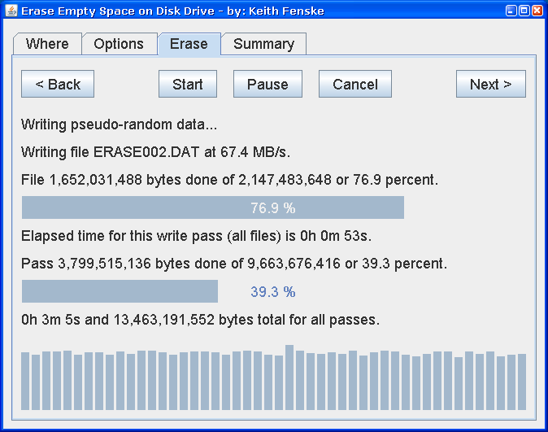

### Erase Disk (Java)

by: Keith Fenske, https://kwfenske.github.io/

EraseDisk is a Java 1.4 graphical (GUI) application to erase and test disk
drives or flash drives. Large temporary files are created and filled with
zeros, ones, or pseudo-random data. Previously deleted files are overwritten.
Existing files are not affected. This cleans up an old disk before it goes in a
new location. Don't trust a new disk until you write data, then read to
confirm. One complete test is usually enough. (Repeated testing may degrade
flash drives.)

Download the ZIP file here: https://kwfenske.github.io/erase-disk-java.zip

Released under the terms and conditions of the Apache License (version 2.0 or
later) and/or the GNU General Public License (GPL, version 2 or later).

